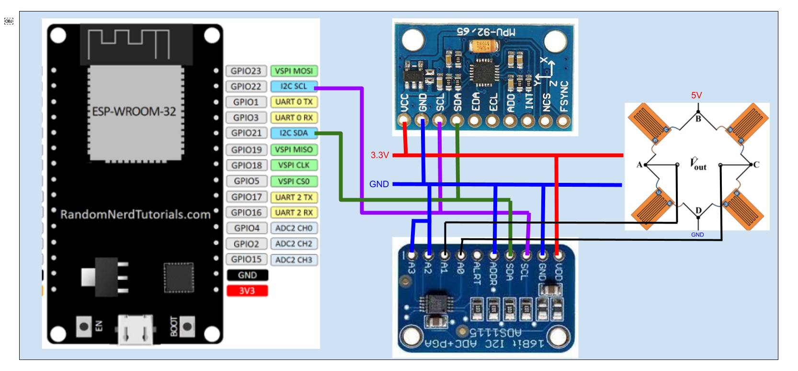

# And1's graduation thesis

### Brief description

My intention was to develop a sensor to monitor and gather data related to torsional loads on a shaft, these loads are usually caused in the system by the actuation of a power generation device, E.g. internal combustion engine, electrical motor, windmill turbines, etc.

Fig 1: Torque generation in a vehicle's power train system (Te: generated from engine, Tg: generated from gearbox, Td: generated from differential, Twl: generated from tire contact with the road), Source:  https://x-engineer.org/automotive-engineering/chassis/vehicle-dynamics/calculate-wheel-torque-engine/

### How it works

It uses a sensor called a strain gauge, this type of sensor is glued to a component's surface and when this surface is under a mechanical load it will deform, since the strain gauge is totally glued to the surface this deformation will also happen in the strain gauge surface, when this happens there will be a change in the sensor's electrical resistance, if a voltage is applied in a system of strain gauges you can use an Arduino controller to read this difference of resistance, which using some basic math and calibration can be converted to a pretty accurate load value.

Fig 2: The basic of how a strain gauge works, Source: https://www.allaboutcircuits.com/textbook/direct-current/chpt-9/strain-gauges/

### Technology

The technologies I'm using to develop the system at this time is listed below:

* **Displacement sensors**: four **strain gauges** are used in the form of a Wheatstone bridge circuit attached to the surface of the analysis subject
* **ADS1115**: 16 bit analog to digital converter and signal amplifier, needed because the difference in voltage caused by the strain gauge deformation is too low for the controller to read accurately
* **ESP32**: a controller board used read the signals obtained by the ADS1115, and transmit the signal via serial connection to the PC 
* **6 axis accelerometer**: know the angular speed of the shaft (which I can use to extract the power values in HP or kW)

Fig 3: An Wheatstone bridge circuit formed of strain gauges, usually the strain gauges are glued to the shaft in a way that 2 of them are under extension while the other two are subject to compression, this increases by a little the voltage output of Vout, thus making it easier to the amplifier to read.

## How does it compare with high accuracy systems

That's the main focus of my thesis, and when I run the experiments I will have an answer to this question. If I find out that the accuracy is good enough I pretend to implement this system in college competition vehicles (Baja SAE, Formula SAE, etc) for live-telemetry and data gathering.

## Controller wiring diagram

## Arduino libraries

Adafruit ADS1X15

Bolder Flight Systems MPU9250

# About this repository

Since I'm creating a device that gathers a lot of data I'm developing software to connect and exchange data from the controller to the computer and vice versa. 

Here you will find codes that I've developed in Python3 to connect it to the device, live plot the data, and the user interface (At the moment I'm focusing my work on it). Also, you will find the Arduino programming codes that I am using to develop the prototype

The bill of materials of the project and mechanical and electrical CAD drawings and models related to it will be uploaded in the short future, I have an initial concept designed already, but it will subject to a big revision regarding the power source of the device and the manufacture of it (3D printing).

# Quick note!!!

At this moment the codes only gather data via Serial protocol (Rx Tx), but I'm still evaluating which communication protocol is the best for live-data gathering in my case, one of the main advantages of the ESP32 controller is that it has built-in Bluetooth low energy and wifi transmitters and receivers.
